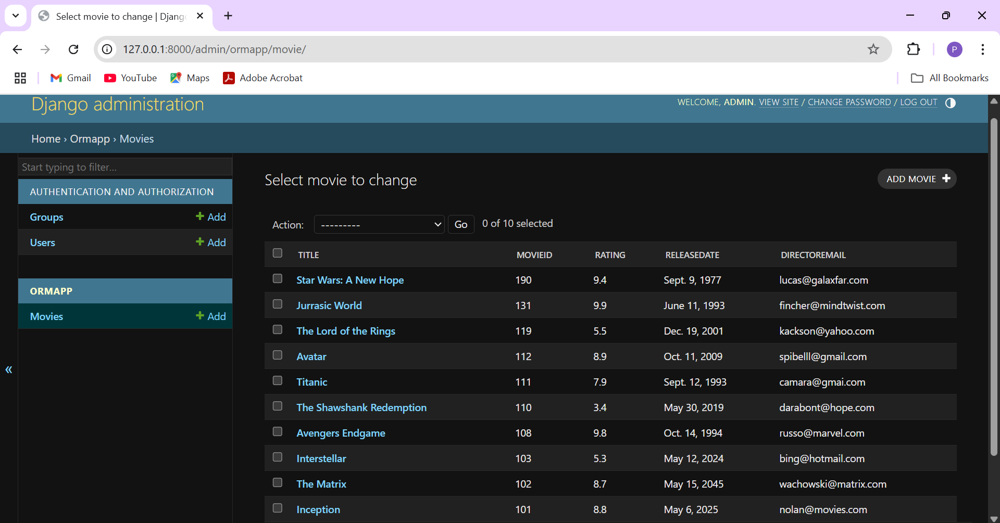

# Ex02 Django ORM Web Application
## Date: 13/04/2025

```
Developed by: Aman Singh
Register no : 212224040020
```

## AIM
To develop a Django application to store and retrieve data from a Movies Database using Object Relational Mapping(ORM).

## ENTITY RELATIONSHIP DIAGRAM


## DESIGN STEPS

### STEP 1:
Clone the problem from GitHub

### STEP 2:
Create a new app in Django project

### STEP 3:
Enter the code for admin.py and models.py

### STEP 4:
Execute Django admin and create details for 10 books

## PROGRAM
```
from django.db import models
from django.contrib import admin
class Student(models.Model):
	Name=models.CharField(max_length=10)
	Refno=models.IntegerField(primary_key="Refno")
	Percentage=models.FloatField()
	DoB=models.DateField()
	Email=models.EmailField()
class StudentAdmin(admin.ModelAdmin):
	list_display=('Name','Refno','Percentage','DoB','Email')

```
```
from django.contrib import admin
from .models import Student,StudentAdmin
admin.site.register(Student,StudentAdmin)
```


## OUTPUT



## RESULT
Thus the program for creating movies database using ORM hass been executed successfully
